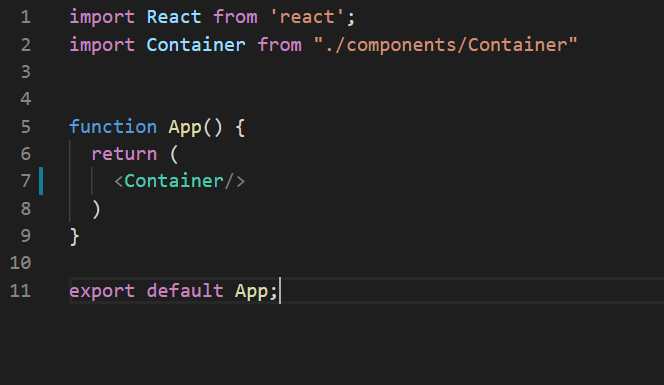

# User-directory

## About The Page ## 

Creating an employee directory with React.

## User Story

* As a user, I want to be able to view my entire employee directory at once so that I have quick access to their information.

## Directory Screen Shots ##

Below are screenshots of my page and code for review:

### Screenshot of the directory page ###

### Screenshot of my APP.JS ###

### Screenshot of my Searchbox Code ###

## Built With ##

    React
    HTML 
    CSS 
    Bootstrap
    VS Code

### Installation ###

    Clone the repo

git clone https://github.com/Mitchelle-B/repo.git

## Contributing ##

    Fork the Project
    Create your Feature Branch (git checkout -b feature/AmazingFeature)
    Commit your Changes (git commit -m 'Add some AmazingFeature')
    Push to the Branch (git push origin feature/AmazingFeature)
    Open a Pull Request

## License ##

Distributed under the MIT License. See LICENSE for more information.
Contact

Project Link: https://github.com/Mitchelle-B/repo
